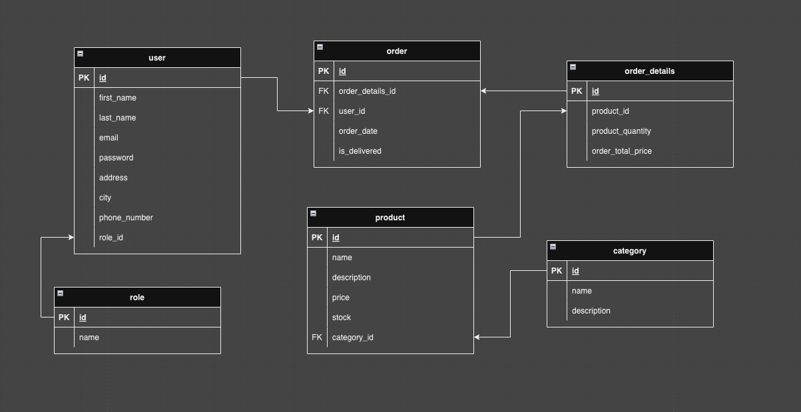
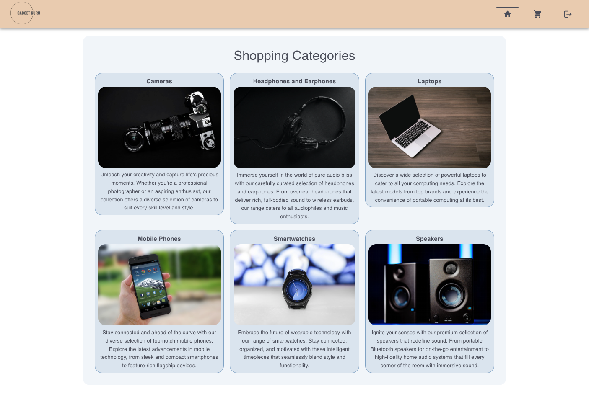
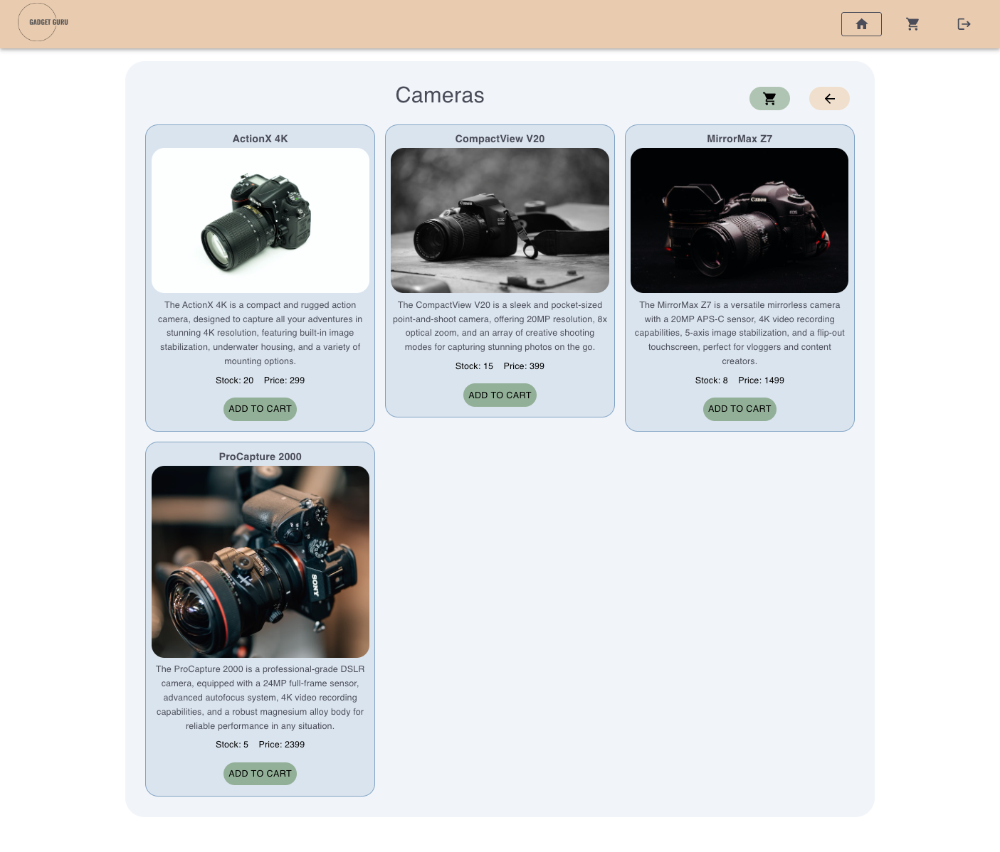
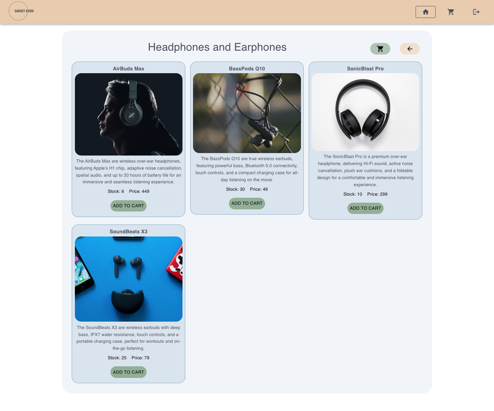
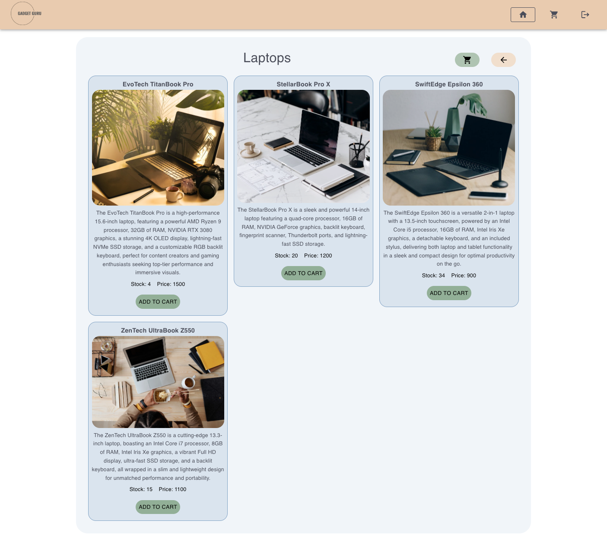
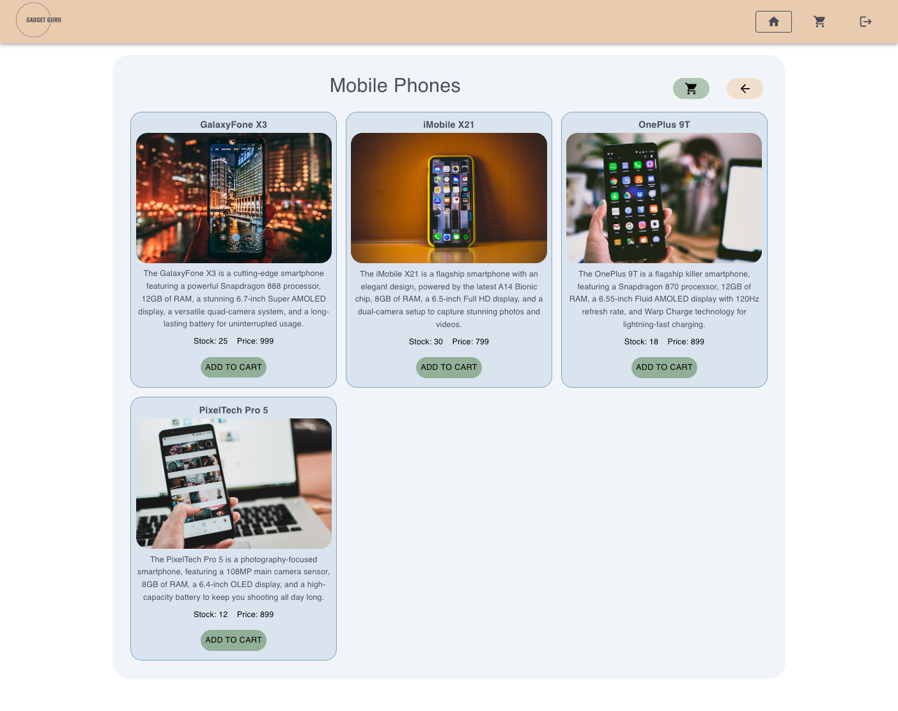
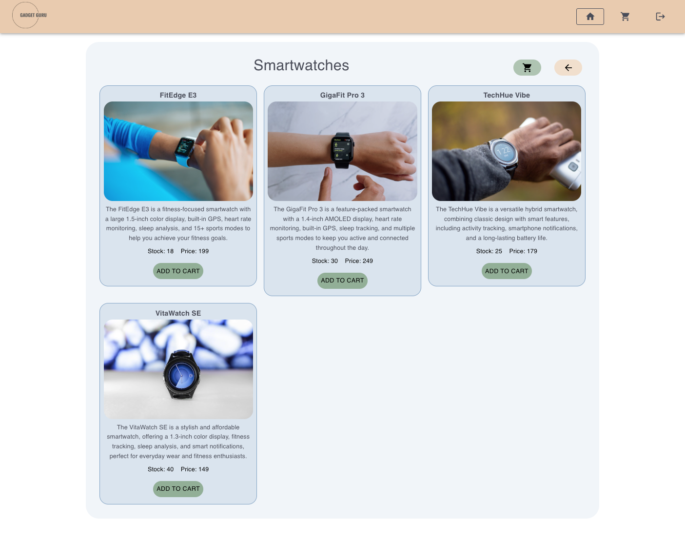
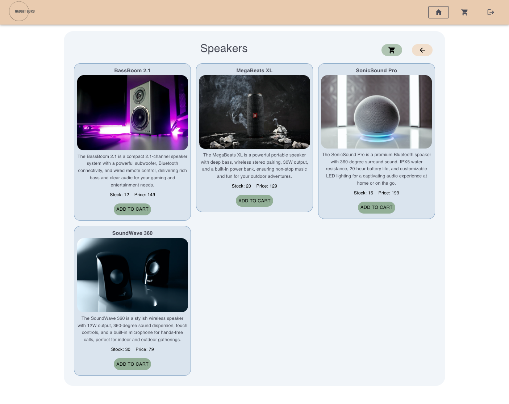

# E-Commerce App

[NodeJs]: https://img.shields.io/badge/node.js-6DA55F?style=for-the-badge&logo=node.js&logoColor=white
[NodeJs-url]: https://nodejs.org/en/docs/
[Postgres]: https://img.shields.io/badge/postgres-%23316192.svg?style=for-the-badge&logo=postgresql&logoColor=white
[Postgres-url]: https://www.postgresql.org/docs/
[Sequelize-ORM]: https://img.shields.io/badge/Sequelize-52B0E7?style=for-the-badge&logo=Sequelize&logoColor=white
[Sequelize-url]: https://sequelize.org/
[Docker]: https://img.shields.io/badge/docker-%230db7ed.svg?style=for-the-badge&logo=docker&logoColor=white
[Docker-url]: https://docs.docker.com/
[React]: https://img.shields.io/badge/react-%2320232a.svg?style=for-the-badge&logo=react&logoColor=%2361DAFB
[React-url]: https://reactjs.org/
[Material-UI]: https://img.shields.io/badge/Material--UI-0081CB?style=for-the-badge&logo=material-ui&logoColor=white
[Material-UI-url]: https://mui.com/material-ui/getting-started/overview/
[React-Redux]: https://img.shields.io/badge/Redux-593D88?style=for-the-badge&logo=redux&logoColor=white
[React-Redux-url]: https://react-redux.js.org/introduction/getting-started

 [![NodeJs]][Nodejs-url] [![Postgres]][Postgres-url] [![Sequelize-ORM]][Sequelize-url] [![Docker]][Docker-url] [![React]][React-url] [![Material-UI]][Material-UI-url] [![React-Redux]][React-Redux-url]

## Table of Contents
- [E-Commerce App](#e-commerce-app)
  - [Table of Contents](#table-of-contents)
  - [Description](#description)
    - [About application](#about-application)
    - [Built with](#built-with)
  - [Getting Started](#getting-started)
    - [Prerequisites](#prerequisites)
    - [Run the project](#run-the-project)
      - [Start backend application](#start-backend-application)
      - [Start frontend application](#start-frontend-application)
  - [Structure](#structure)
    - [Client folder](#client-folder)
    - [Server folder](#server-folder)
  - [Database](#database)

## Description
### About application

### Built with
This is a REST API for E-Commerce App created with: 
- **Framework Frontend** - [ReactJS](https://reactjs.org/) + [Vite](https://vitejs.dev)  
- **Framework Backend** - [Node.js](https://nodejs.org/en/docs/)
- **Database** -- [PostgreSQL](https://www.postgresql.org/docs/) 
- **ORM** - [Sequelize](https://sequelize.org/docs/v6/)
- **Virtualization** - [Docker](https://docs.docker.com/)
- **Frontend state management** - [React Redux](https://react-redux.js.org)
- **Frontend UI library** - [Material UI](https://mui.com/)
- **Frontend notification** - [React Toastify](https://www.npmjs.com/package/react-toastify)

## Getting Started

### Prerequisites
- install [Node](https://nodejs.org/en/download/)
- install [Docker](https://www.docker.com/) 
### Run the project

1. Clone GitHub repository:
   ```
   git clone https://github.com/markogithubst/ecommerce_app.git
   ```


#### Start backend application

1. Open ```server``` folder

2. Create a `.env` file based on `.envExample` file:
    ```
    NODE_ENV=environment
    PORT=port
    DB_HOST=localhost
    DB_PORT=5432
    DB_USERNAME=username
    DB_PASSWORD=password
    BASE_URL='http://localhost:5173'
    ```
3. Start the project:
   ```
   docker-compose up
   ```
   - this command generates/seeds database and starts the application 


#### Start frontend application

1. Open ```client``` folder

2. Install all packages:
   ```
   npm install
   ```

3. Create a `.env` file based on `.envExample` file:
    ```
    VITE_SERVER_API_URL=http://localhost:3000
    VITE_LOGIN_URL='http://localhost:3000/ecommerce'
    ```
4. Start the project
    ```
    npm run start
    ```
4. If the app does not automatically open in your default browser open:
    ```
    http://localhost:5137
    ```
## Structure
```
.
├── README.md
├── client
│   ├── index.html
│   ├── package.json
│   ├── public
│   ├── src
│   └── vite.config.js
└── server
    ├── Dockerfile
    ├── app.js
    ├── controllers
    ├── database
    ├── docker-compose.yml
    ├── middleware
    ├── package.json
    ├── routes
    ├── server.js
    ├── services
    └── utils
```

### Client folder
- **public** - contains the static assets (e.g., index.html, images) to be served with the application
- **src** - contains the source code of the React application, including components, Redux store, and other helper functions
- **index.html** - the HTML file that serves as the entry point for the application and includes the root element where React will render the application
- **vite.config.js** - the configuration file for the Vite build tool, which includes settings for bundling, transpiling, and optimizing the application for production

### Server folder
- **Dockerfile** - specifies the steps to build a Docker image
- **app.js** - defines an Express application with middleware for handling JSON requests, directing incoming requests to specific API endpoints to the corresponding functions or handlers and handling errors
- **controllers** - functions that corresponds to the routers to handle requests
- **database** - configuration of database, models, migration and seeder files
- **docker-compose.yml** -  specifies a set of services and their configurations for a Docker application with multiple containers
- **middleware** - functions for error handling
- **routes** - for help determine which controllers receive certain requests
- **server.js** - file for listen the connections on the specified host and port
- **services** - 
- **utils** - files that are used throughout the entire server folder with helper functions

## Database


## Frontend homepage:


## Frontend product pages:
####  Cameras section


####  Headphones and Earphones section


####  Laptops section


#### Mobile Phones section


####  Smartwatches section


####  Speakers section
